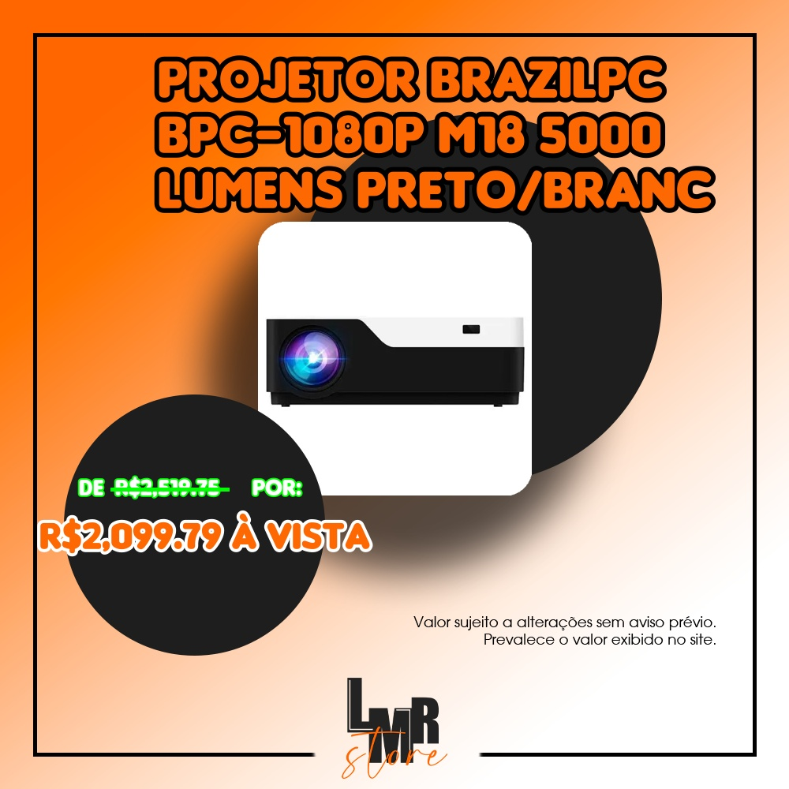

# "Promotion Creator"
Projeto direcionado à criação e publicação automática de imagens e vídeos em redes sociais(Twitter, Instagram, Youtube) de promoções anunciadas em grupos do telegram.

Versão pública não testada, teve apenas o código organizado e publicado.

## Tecnologias utilizadas

- Beautiful Soup
- Telethon
- Pillow
- Numpy
- Regex
- MoviePy

## Exemplos de ofertas criadas 100% automaticamente:

## Vídeo de exemplo gerado para publicação de vídeo:
[Vídeo Exemplo](https://youtu.be/kAFzJmWIspE "Vídeo Exemplo")
